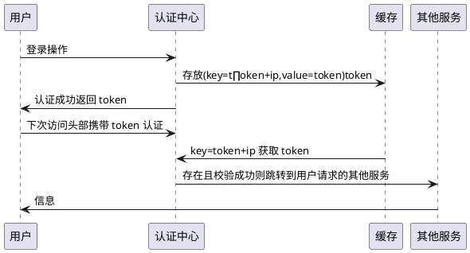

<!--
 * @Author: your name
 * @Date: 2020-07-29 21:37:21
 * @LastEditTime: 2020-08-08 01:28:11
 * @LastEditors: Please set LastEditors
 * @Description: In User Settings Edit
 * @FilePath: \read note\book_note\understanding_of_JVM.md
-->

# 第三章 垃圾收集器与内存分配策略

## 3.5 垃圾收集器

### 3.5.6 CMS 收集器

整个过程分为四个步骤：

1. 初始标记
2. 并发标记
3. 重新标记
4. 并发清除

初始标记和重新标记阶段需要停止用户线程

#### 缺点

- 占用了一部分线程导致应用程序变慢，降低总吞吐量，在四核以下的机器上很明显
- 因为用户线程和 gc 线程几乎同时在运行，用户线程运行时还需要一定的内存，所以不能等到老年代快满了再收集，需要提前一点，给用户线程预留足够的运行内存。如果内存不够用户线程运行，则会有“并发失败”，并转为使用 Serial Old 收集。
- “标记-清除”的固有缺陷：内存碎片化

### 3.5.6 G1 收集器

不再把堆空间严格的按代划分，而是把堆分为多个大小相同的 region，每个 region 都可以是 eden，survivor，老年代，根据 region 的类型，采用不同的收集策略。

G1 收集器追踪每个 Region 里面垃圾堆积的“价值”大小，价值即回收所获得的空间和所需时间，后台维护一个优先级列表，根据用户设置允许的收集停顿时间，优先处理回收价值收益最大的 region。

收集过程：

1. 初始标记：标记 root 直接关联的对象，需要停止用户线程
2. 并发标记：和用户线程并发执行
3. 最终标记：处理并发标记阶段用户线程引用变动的对象，需要停止用户线程
4. 筛选回收
   1. 更新 region 统计数据
   2. 堆 region 回收价值排序
   3. 根据用户期望停顿时间制定回收计划
   4. 把决定回收 region 中存活的对象复制到空 region，清空旧 region
   5. 这一阶段需要停止用户线程

## 3.6 低延迟垃圾收集器

### Shenandoah 收集器

收集过程：

1. 初始标记：标记与 root 直接关联的对象，需要“stop the world”，停顿时间与堆大小无关，只和 roots 的数量有关
2. 并发标记：和用户线程并发执行
3. 最终标记：处理上一阶段用户线程导致的对象变化，统计回收价值最高的 region。会有短暂停顿
4. 并发清理：用于清理整个 region 一个存活对象都没有找到的 region
5. 并发回收：把回收集中存活的对象复制到未使用的 region 中。重点是：**可以和用户线程并发进行**，移动过程中用户线程导致的对象变化使用“转发指针”解决。
6. 初始引用更新：确认收集器线程已经完成了对象移动任务
7. 并发引用更新：_引用更新：把最终指向旧对象的引用修正到复制后的新地址_，和用户线程并发执行，按照内存物理地址顺序，线性搜索引用类型，把旧值修改为新值
8. 最终引用更新：修正 GC root 中的引用，需要停顿
9. 并发清理：回收 region 内存

> 黄色区域代表入选回收集的 region，绿色区域代表存活的对象，蓝色区域代表用户线程可以用来分配对象内存的 region。

---

## 3.7 选择合适的垃圾收集器

### 3.7.3 垃圾收集日志

1. 查看 GC 基本信息：
   1. JDK9 之前用-XX:+PrintGC
   2. JDK9 之后使用-Xlog:gc
2. 查看 GC 详细信息：
   1. JDK9 之前使用-XX:+PrintGCDetails
   2. JDK9 之后使用-X-log:gc\*
3. 查看 GC 前后的堆、方法区的可用容量变化：
   1. JDK9 之前使用 -XX:+PrintHeapAtGC
   2. JDK 之后使用 -Xlog:gc+heap=debug
4. 查看 GC 过程中用户线程并发时间以及停顿的时间
5. 查看收集器 Ergonomics 机制自动调节的相关信息（自动设置堆空间个分代区域的大小、收集目标等内容）
6. 查看熬过收集后剩余对象的年龄分布信息

# 第 4 章 虚拟机性能监控、故障处理工具

## 4.2 基础故障处理工具

### 4.2.1 jps：虚拟机进程状况工具

列出正在运行的虚拟机进程

`jps -v`: 列出虚拟机启动时显式指定的参数

### 4.2.2 jstat：虚拟机运行状态信息监控

可以运行在没有图形界面、只提供了纯文本控制台环境的服务器上

### 4.2.3 jinfo：Java 配置信息工具

作用是实时查看和调整虚拟机各项参数

### 4.2.4 jmap：Java 内存映像工具

可以生成堆转储快照

### 4.2.5 jhat：虚拟机堆转储快照分析工具

和 jmap 搭配使用，来分析 jmap 生成的堆转储快照

### 4.2.6：Java 堆栈跟踪工具

生成虚拟机当前时刻的线程快照。线程快照就是当前虚拟机内每一条线程正在执行的方法的堆栈的集合，可以用来定位线程死锁、死循环、请求外部资源挂起等。

- [x] Sdfasdf

